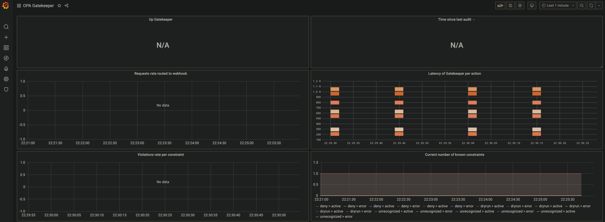

# 🖥️ 👓 Monitor your OPA Gatekeeper via Grafana Dashboard

# Setup Cluster
You can start your local kubernetes cluster via KinD or minikube
```bash
$ minikube start
```
# Deploy Gatekeeper via Helm
You can deploy OPA Gatekeeper via plain YAML or Helm chart, in this guide we are going to use Helm to deploy OPA Gatekeeper
```bash
$ helm repo add gatekeeper https://open-policy-agent.github.io/gatekeeper/charts
$ helm install gatekeeper gatekeeper/gatekeeper
```
# Install Prometheus Operator via Helm
```bash
$ kubectl create namespace monitoring
$ helm repo add prometheus-community https://prometheus-community.github.io/helm-charts
$ helm install kube-prometheus-stack prometheus-community/kube-prometheus-stack --namespace monitoring
```

# Intall ServiceMonitor
You need to scrape gatekeeper metrics, in order to that you need a resource which is kind ServiceMonitor and you need a new port which is "metrics" in this case to the gatekeeper service like the following:
```yaml
ports:
- name: https
  port: 443
  targetPort: 8443
- name: metrics                                                                
  port: 8888
```
```bash
$ kubectl apply -f monitoring/servicemonitor.yaml
```

# Apply Sample Policies
```bash
$ kubectl apply -f policies/privileged-containers-contraints-template.yaml
$ kubectl apply -f policies/privileged-containers-constraint.yaml
```

# Test
```bash
$ kubectl apply -f samples/
```

# Open Dashboard
```bash
$ kubectl port-forward -n monitoring svc/kube-prometheus-stack-grafana 3000:80
$ open localhost:3000 # username: admin password: prom-operator
```
After you opened the dashboar, you need to import the your dashboard, in order to do that copy your [dashoard.json](monitoring/dashboard.json) add paste to the import section of the grafana dashboard, then vola !

